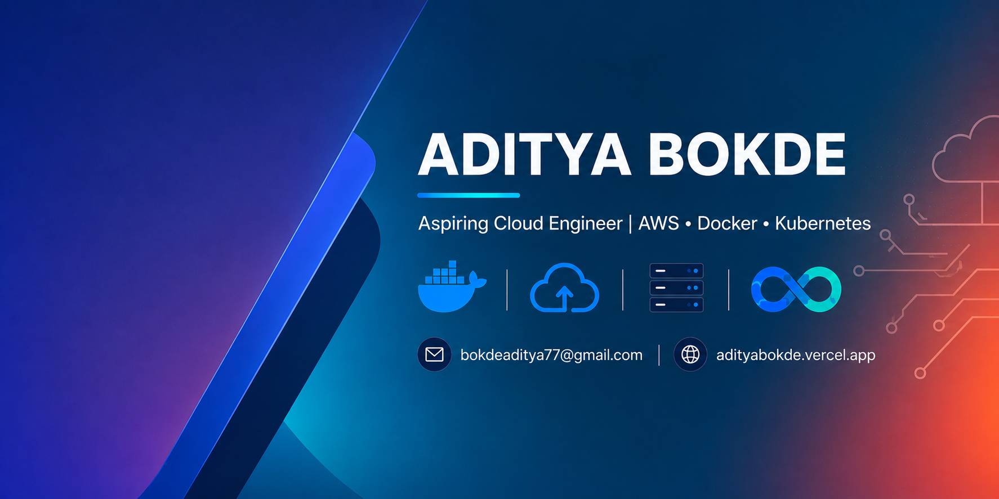

---

## About Me

I'm **Aditya Bokde**, a 2nd-year B.Tech CSE (Cloud Computing) student at MIT World Peace University, having transitioned into the program via lateral entry after completing my Diploma in Computer Technology at Dharampeth Polytechnic, Nagpur.

My focus has evolved from data-driven development toward **Cloud Engineering and DevOps** — building the skills needed to design, deploy, and manage scalable, reliable systems on the cloud. I'm currently strengthening my foundations in AWS, Docker, Kubernetes, Linux, and CI/CD pipelines, while continuing to build and ship real-world projects.

I enjoy solving practical problems through hands-on work — from building and deploying full-stack applications to automating workflows and managing cloud infrastructure. I'm actively working toward a career as a **Cloud Engineer / DevOps Engineer**, and I'm always open to learning, collaborating, and taking on projects that push me to build production-grade, cloud-native systems.

---

## Skills

&nbsp;

&nbsp;

&nbsp;

&nbsp;

---

## GitHub Contributions

---

## GitHub Stats

&nbsp;

&nbsp;

